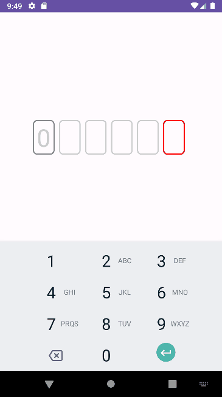

# CustomCompasables

Implementation of various custom UI components based on Jetpack Compose, for use in my projects.

## Custom OTP field by tutorial(https://proandroiddev.com/jetpack-compose-otp-input-field-bcfa22c85e5f) from Ban Markovic

## Collapsing toolbar with parallax effect by tutorial(https://proandroiddev.com/collapsing-toolbar-with-parallax-effect-and-curve-motion-in-jetpack-compose-9ed1c3c0393f) from Morad Azzouzi

